# CrimeNet

**Tagline:**  
_Revolutionizing collaborative crime-solving with real-time chat, secure media, and recruiter-driven case management._

---

<!-- ## 🎥 Demo Video -->
<!-- 
[](https://drive.google.com/file/d/1U82FgrFXAnIIa0UyxkKrZ8IEyyp0WFFY/view?usp=drive_link) -->

<!-- Alternative video embedding options:
For YouTube: [](http://www.youtube.com/watch?v=VIDEO_ID)
For direct video: <video width="800" controls><source src="demo_video.mp4" type="video/mp4"></video>
-->

---

<!-- ## 📸 Screenshots

### Login & Authentication
<div align="center">
  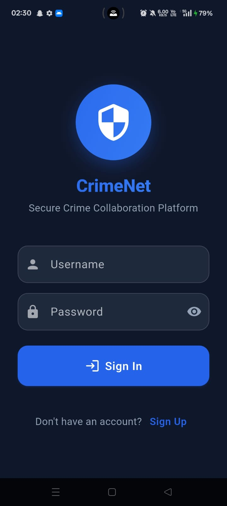
  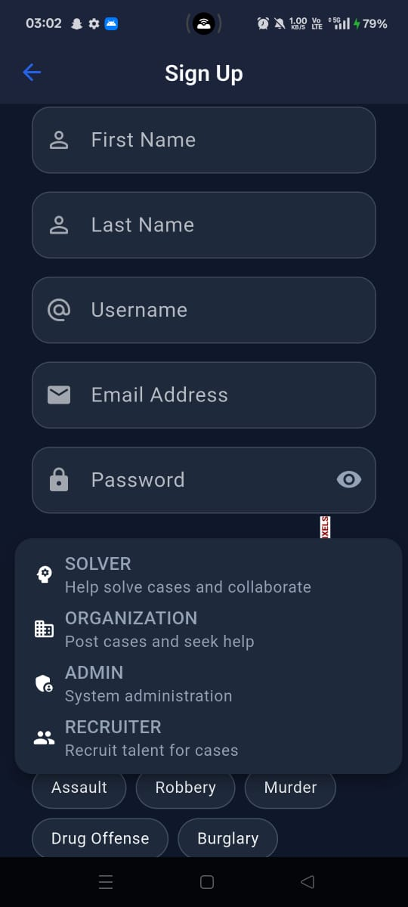
</div>
<p align="center"><em>Secure JWT-based authentication with elegant UI design</em></p>

### Case Management
<div align="center">
  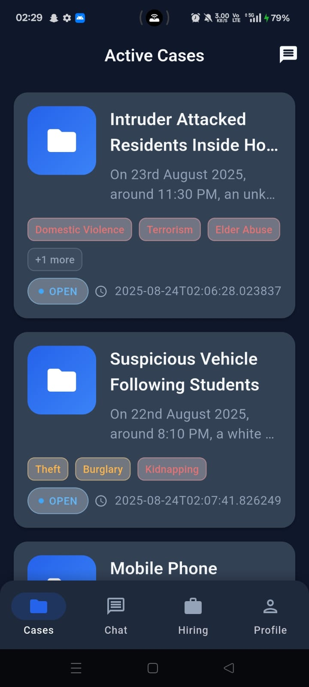
  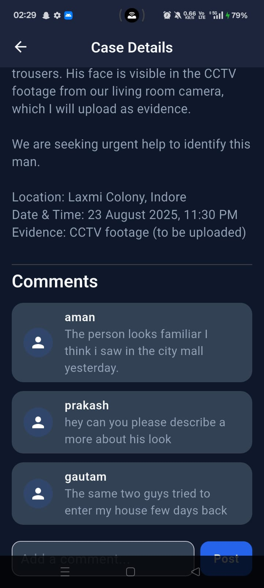
</div>
<p align="center"><em>Comprehensive case management with detailed views and status tracking</em></p>

### Create Case & Media Upload
<div align="center">
  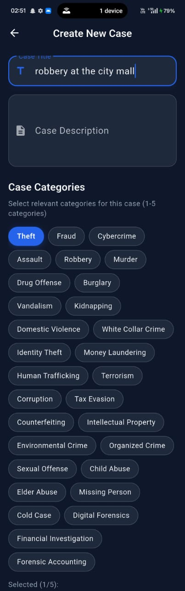
  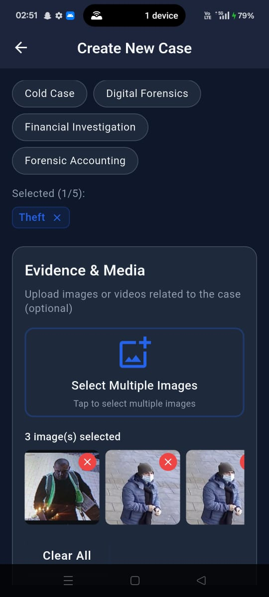
</div>
<p align="center"><em>WhatsApp-like multi-image selection with Firebase Storage integration</em></p>

### Chat & Communication
<div align="center">
  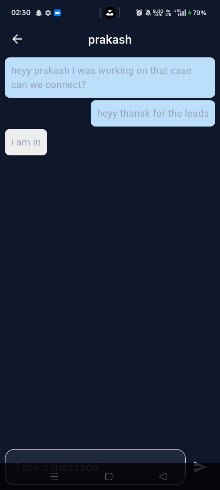
  
</div>
<p align="center"><em>Real-time WebSocket communication for seamless collaboration</em></p>

### Hiring & Recruitment System
<div align="center">
  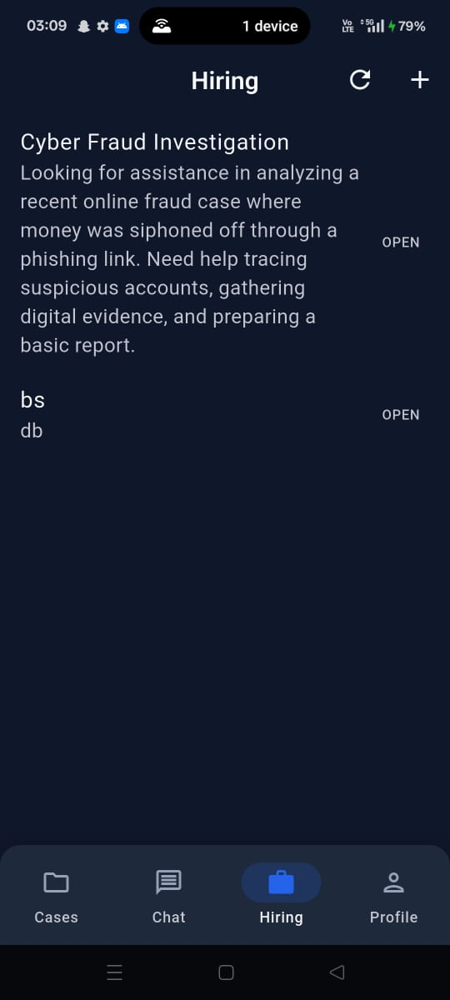
  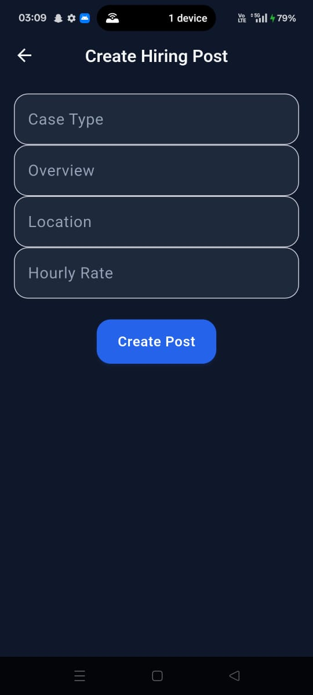
</div>
<div align="center" style="margin-top: 10px;">
  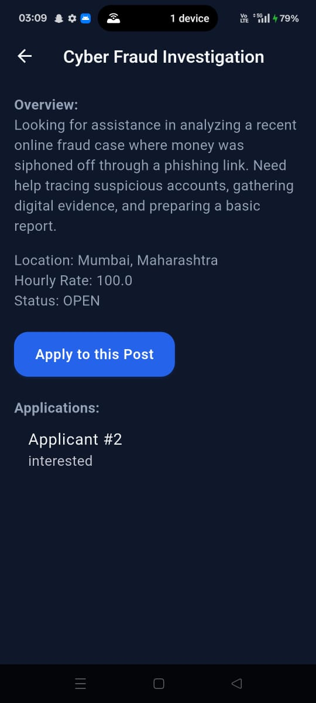
</div>
<p align="center"><em>Complete recruitment workflow for crime investigators and applicants</em></p>

### User Profile & Dashboard
<div align="center">
  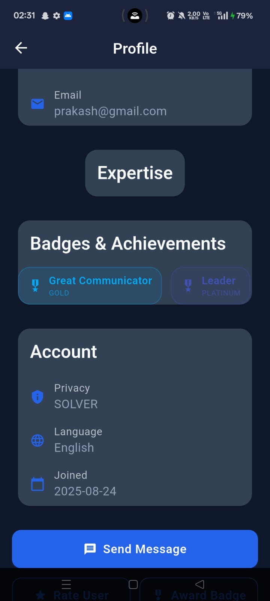
  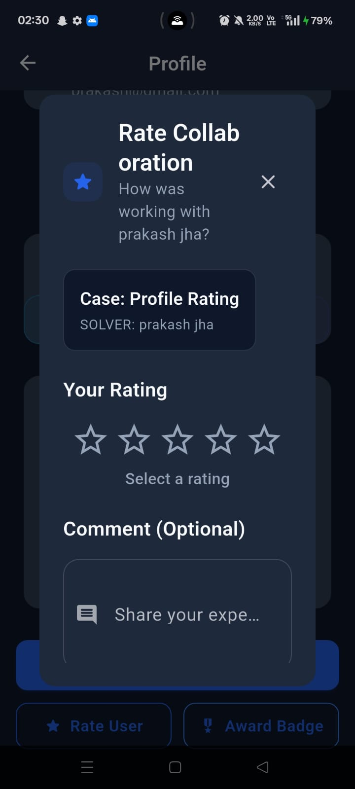
</div>
<p align="center"><em>Intuitive user interface with comprehensive dashboard and profile management</em></p>

---

## 🌟 Key Features Showcase

| Feature | Description | Technology |
|---------|-------------|------------|
| 🔐 **Secure Authentication** | JWT-based login system with role management | Spring Security + JWT |
| 📱 **Multi-Image Upload** | WhatsApp-like image selection and upload | Flutter + Firebase Storage |
| 💬 **Real-time Chat** | Instant messaging between case collaborators | WebSocket + STOMP |
| 📋 **Case Management** | Complete CRUD operations for crime cases | Spring Boot + PostgreSQL |
| 🎥 **Video Support** | Upload and playback video evidence | Flutter Video Player |
| 🏷️ **Tag System** | Categorize cases with multiple tags | JPA + Collections |
| 📊 **Progress Tracking** | Monitor case status and participation | Custom Entity Relationships |
| 🔍 **Search & Filter** | Advanced case discovery capabilities | Spring Data JPA |

---

## 🚀 Introduction

CrimeNet is a full-stack, modern platform designed for collaborative crime investigation and recruitment. Built with Flutter, Spring Boot, Firebase Storage, and PostgreSQL, it empowers investigators, recruiters, and applicants to work together seamlessly—featuring secure authentication, real-time communication, and robust media handling.

---

## ✨ Features

- **JWT-Based Authentication:** Secure login & signup for all users.
- **Case Management:** Create, view, and manage crime cases with rich details.
- **Media Uploads:** Attach images and videos to cases, stored securely in Firebase Storage.
- **Real-Time Chat:** WebSocket-powered messaging for users assigned to the same case.
- **Recruiter-Applicant Workflow:**  
  - Recruiters post cases with hourly rates and requirements.
  - Applicants apply directly; recruiters can view profiles and initiate private chats.
- **Commenting System:** Discuss and collaborate on cases.
- **Participation Tracking:** Monitor user involvement and case progress.
- **RESTful APIs:** Clean, scalable backend endpoints.
- **State Management:** Efficient UI updates using Provider in Flutter.

---

## 🛠️ Tech Stack

- **Frontend:** Flutter (Dart)
- **Backend:** Spring Boot (Java)
- **Database:** PostgreSQL
- **Media Storage:** Firebase Storage
- **Authentication:** JWT (JSON Web Token)
- **Real-Time:** WebSocket (STOMP)
- **State Management:** Provider (Flutter)

---


## ⚡ Installation & Setup

### 1. Backend (Spring Boot)

```bash
# Clone the repo
git clone https://github.com/darpan2004/CrimeNet.git
cd crime_sovlver_app

# Configure PostgreSQL in src/main/resources/application.properties
# (Set DB URL, username, password)

# Build & run
./gradlew bootRun
```

### 2. Frontend (Flutter)

```bash
# In a new terminal
cd ../crimenet_frontend

# Install dependencies
flutter pub get

# Configure Firebase (add your google-services.json and Info.plist)

# Run the app
flutter run
```

---

## 💡 Unique Highlights

- **WebSocket Real-Time Chat:** Instant messaging for case collaborators.
- **Firebase Media Storage:** Secure, scalable image/video uploads.
- **Recruiter-Driven Workflow:** Modern hiring and application process for investigators.
- **Provider State Management:** Smooth, responsive UI.

---

## 📬 Contact

For questions or collaboration, reach out via [LinkedIn](https://www.linkedin.com/in/darpankhatri/) or open an issue!

---

**Impress, inspire, and innovate with CrimeNet.** -->