## CrimeControl 👮‍♂️

**Tagline:**  
_Revolutionizing collaborative crime-solving with real-time chat, secure media, and recruiter-driven case management._

## Introduction 🚀

CrimeControl is a full-stack, modern platform designed for collaborative crime investigation and recruitment. Built with Flutter, Node.js, Socket.IO, Firebase Storage, it empowers investigators, recruiters, and Solvers to work together seamlessly—featuring secure authentication, real-time communication, and robust media handling.

## 📸 Screenshots

### Authentication

  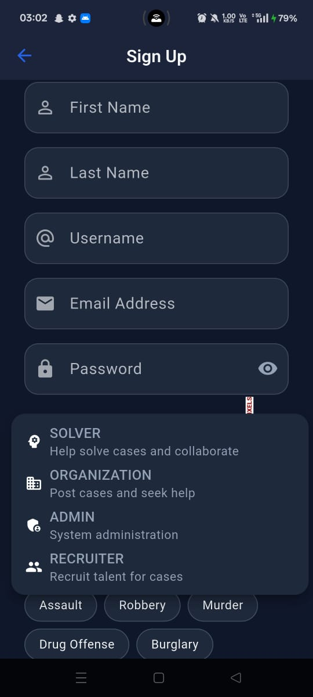

<em>Secure JWT-based authentication with elegant UI design</em>

### Case Management

  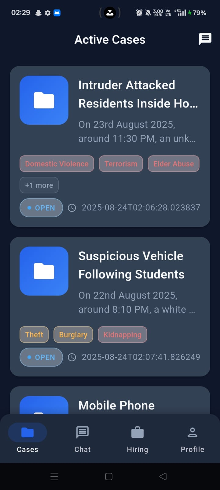
  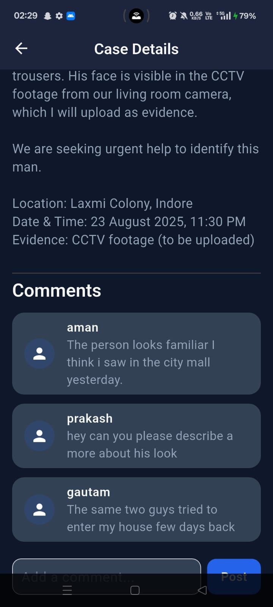

<em>Comprehensive case management with detailed views and status tracking</em>

### Create Case & Media Upload

  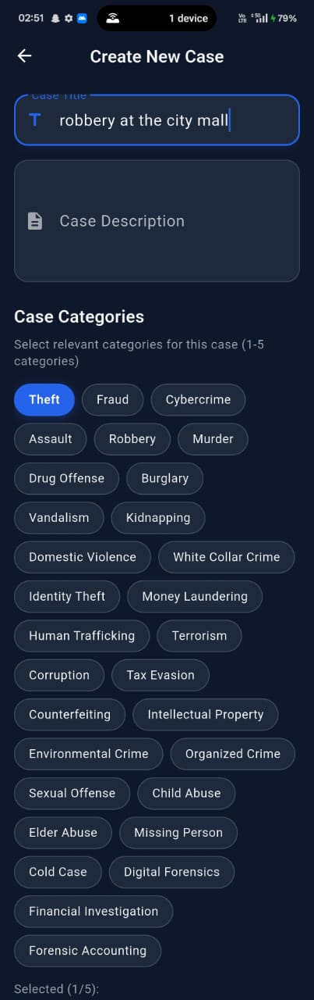
  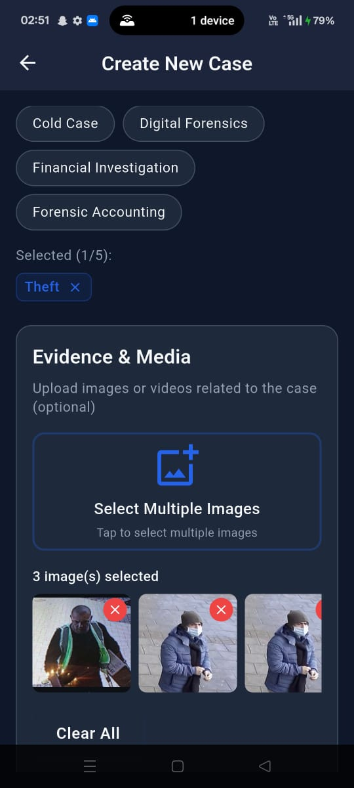

<em>WhatsApp-like multi-image selection with AWS S3 integration</em>

### Chat & Communication

  
  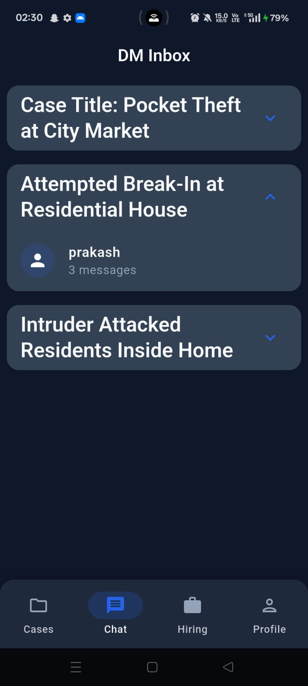

<em>Real-time WebSocket communication for seamless collaboration</em>

### Hiring & Recruitment System

  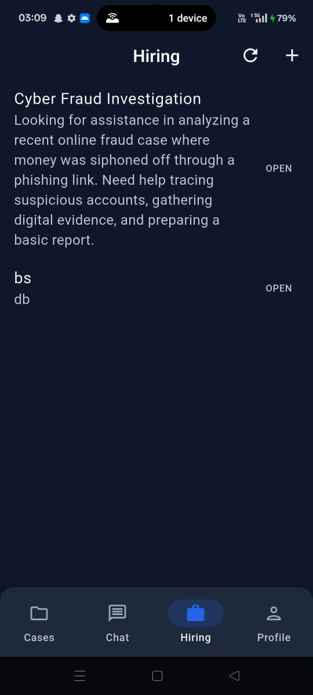
  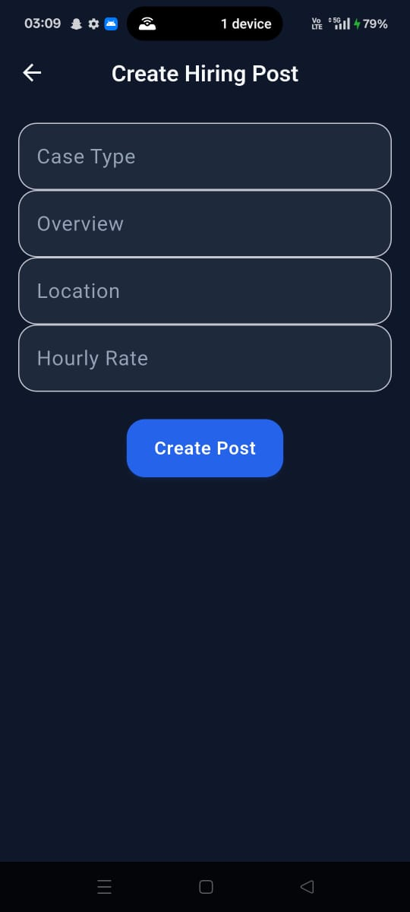

  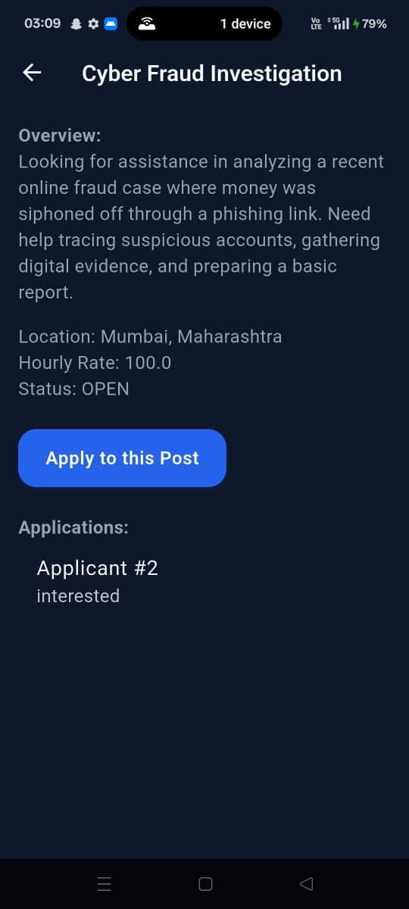

<em>Complete recruitment workflow for crime investigators and applicants</em>

### User Profile & Dashboard

  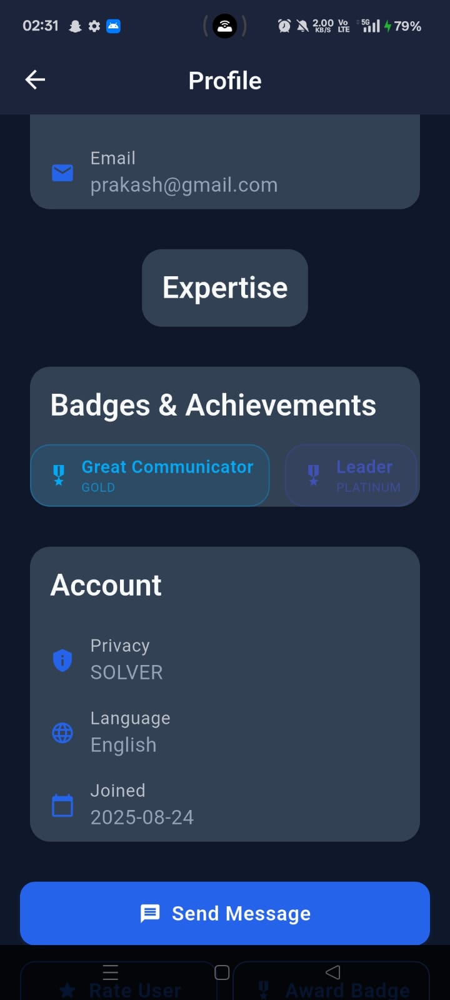
  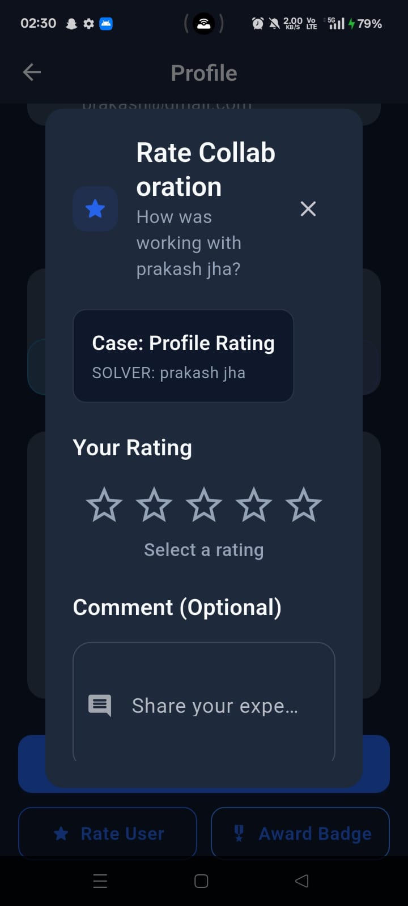

<em>Intuitive user interface with comprehensive dashboard and profile management</em>

## Role Based Access 🛡️

### 🏢Organization
Organizations like investigating authorities or individual entity can use this platform and post unsolved cases:

**✨ Features of Organization**
 
| Feature | Description |
|---------|-------------|
| 📝 **Post Cases** | Create and publish unsolved crime cases with detailed information.|
| 🏷️ **Tag System** | Categorize cases with multiple tags | 
| 📁 **Media Management** | Upload image file and video file related to case.|
| 💬 **Real-Time Communication** | Instant messaging with individuals who comments.|
| 🔍 **Individual Review** | View individual profiles, credentials, and qualifications.|
| 📈 **Case Status Updates** | Update and manage case status through workflow stages.|
| 📋 **Badge & Rating** | Provide Badge and Rating to solvers who help in solving cases.|

### 🕵️‍♂️Solver 
Solver is an individual in the community that can help in solving cases posted by Organization and can be hired by any Recruiter.  

**✨ Features of Solver**

| Feature | Description |
|---------|-------------|
| 🔍 **Browse Cases** | View and search unsolved crime cases posted by organizations. |
| 💬 **Commenting & Discussion** | Contribute ideas and collaborate on case solving. |
| 📝 **Apply to Cases** | Submit applications to work on specific cases posted by Recruiters for hiring.|
| 👤 **Profile Management** | Build and showcase credentials, experience, and ratings. |
| ⭐ **Rating & Badges** | Earn badges and ratings from organizations  and Recruiters for successful contributions. |
| 💰 **Earn Opportunities** | Get hired by recruiters for investigation work. |
| 💭 **Solver Collaboration Chat** | Real-time messaging with other solvers working on the same case. |

### 🧑‍💼Recruiter 
Recruiter is an individual or entity that can use this platform for hiring solvers for any specific case.

**✨ Features of Recruiter**

| Feature | Description |
|---------|-------------|
| 📋 **Post Hiring Opportunities** | Create job postings with case details, hourly rate, and location. |
| 👥 **View Applicants** | See list of solvers who have applied to your job postings. |
| 👤 **Browse Solver Profiles** | View detailed profiles, credentials, experience, and ratings of applicants. |
| 💬 **Direct Communication** | Real-time messaging with applicants during hiring process. |
| ⭐ **Rate & Review** | Provide ratings and feedback on solver performance. |

---

## Tech Stack 🛠️

- **Frontend:** Flutter (Dart)
- **Backend:** Node.js
- **Database:** MongoDB
- **Media Storage:** AWS S3
- **Authentication:** JWT (JSON Web Token)
- **Real-Time:** Socket.IO
- **State Management:** Provider (Flutter)
